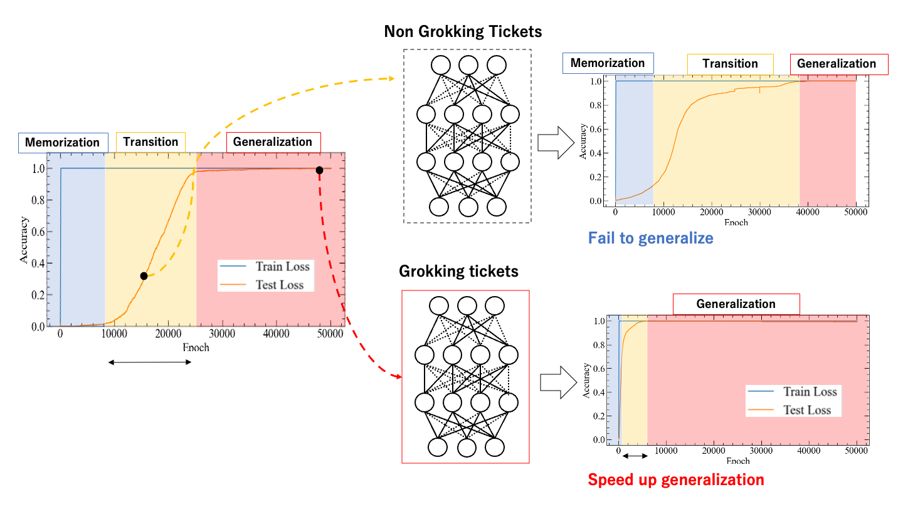
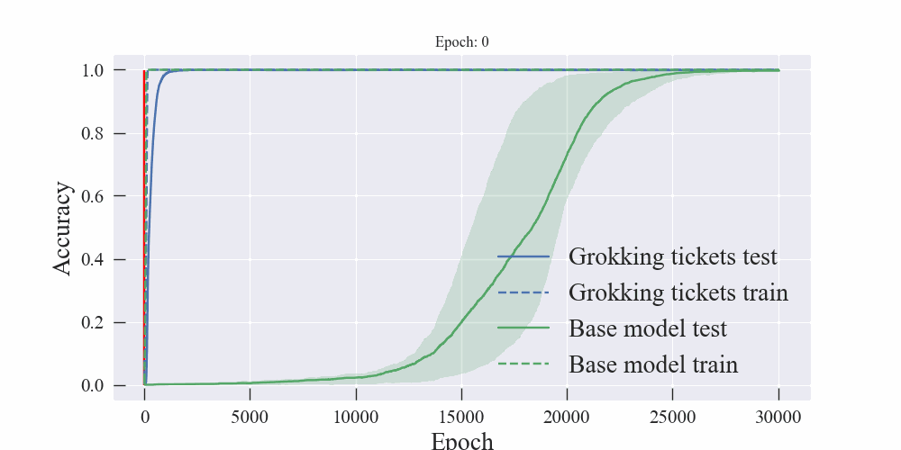
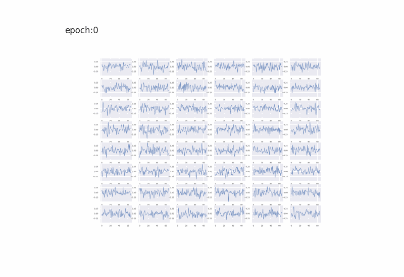
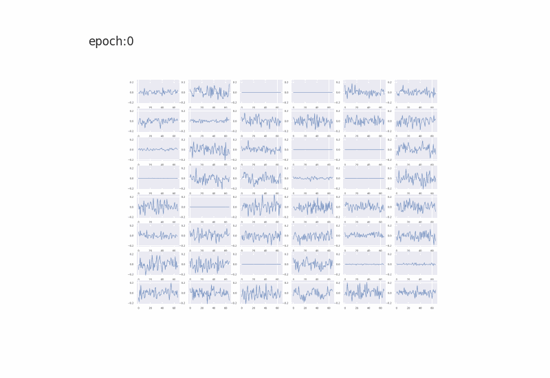

# Grokking Tickets: Lottery Tickets Accelerate Grokking
--- 
by Gouki Minegishi, Yusuke iwasawa, Yutaka Matsuo  
arxiv link : ...  


## Setup
1. Set up a virtualenv with python 3.7.4. You can use pyvenv or conda for this.
2. Run pip install -r requirements.txt to get requirements

## Config
- config.py : Base model
- config_mnist.py : Mnist

## Training Base Model
### Modular addition

```bash
python train.py --config configs/config.py
```
Training confguration is written in `config/config.py`.

### Mnist

```bash
python train_mnist.py --config configs/config_mnist.py
```
Training confguration is written in `config/config_mnist.py`.

## Grokking Tickets
### Modular addition
```bash
python prune.py --config configs/config_pruning.py
```
Training confguration is written in `config/config_pruning.py`.
### Mnist
```bash
python prune_mnist.py --config configs/config_pruning_mnist.py
```
Training confguration is written in `config/config_pruning_mnist.py`.
<p align="center">

 
</p>